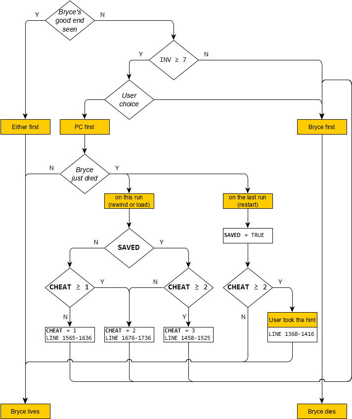

# Italian translation of [AwSW](https://store.steampowered.com/app/571880/Angels_with_Scaly_Wings/)

## Status

Currently working on `Remy`'s sections. Files done and up for review:

    common.rpy
    dv.rpy

    screens.rpy
    status.rpy
    help.rpy
    images.rpy
    script.rpy

    chapter1.rpy
    chapter2.rpy
    chapter3.rpy
    chapter4.rpy
    chapter5.rpy
    chapter5evilending.rpy

    adine1.rpy
    adine2.rpy
    adine3.rpy
    adine4.rpy
    adine5.rpy

    anna1.rpy
    anna2.rpy
    anna3.rpy
    anna4.rpy
    anna5.rpy

    bryce1.rpy
    bryce2.rpy
    bryce3.rpy
    bryce4.rpy
    bryce5.rpy

    lorem1.rpy
    lorem2.rpy
    lorem3.rpy
    lorem4.rpy
    lorem5.rpy

    remy1.rpy
    remy2.rpy
    remy3.rpy
    remy4.rpy

## Remarks and issues

* Having considered the developer's opinion, and given the precedent of game *Neo Cab*, I decided to use [Inclusive Italian][1] to help address the player character with a neutral gender. I took the liberty of updating the fonts with `ə` and `ɜ`, needed for such neutral gender, as well as with accented vowels, which were needed anyway. 
On the other hand the `System`, as well as the `Administrator` in `chapter4.rpy`, are currently addressed with the male form for lack of a better alternative, but this is still subject to change. Also, `Emera` is addressed by all other characters with formal pronouns, as are `Anna` by `Adine`, `Sebastian` by `Adine` and `Lorem`, and `Adine` by `Sebastian` in those few cases.

* I decided to use the characters' variables, which are defined in `images.rpy`, in place of their plain names where possible throughout the script, e.g. `Reza` → `[Rz]`, to reduce the risk of typos when translating.

* Sometimes, translated lines matching their source don't get rendered for some reason, and the only way I found to bypass the issue is to differentiate them by just putting a blank at the end.

* There's also an issue when switching languages to Italian, or starting the game in Italian for the first time, where the new symbols don't get rendered. This only seems to affect the `Titillium Web` family of fonts, and restarting or reloading the game seems to resolve the issue. My guess is that the primary fonts are still used instead of the secondary ones provided in `tl/italiantl`. This ought to be further investigated, although it would probably be best to just put the new symbols in the primary fonts and remove the secondary ones altogether.

* As a design choice, the developer eventually decided that no gameplay sequence would ever lead to both `Anna` and `Damion` surviving `Reza`'s break-in between `chapter2.rpy` and `chapter3.rpy`. However, dead branches are still found in the game, and therefore still made available for translation whenever any dialogue is involved. This dialogue is never spoken, but it should probably be taken into account when translating related branches.

[1]:https://italianoinclusivo.it/

## How can I contribute?

1. To start, have a look at the pinned threads in the dedicated [Steam sub-forum][2]; there you'll also find the Italian translation thread.
2. You can contact me either through [Steam][3] or [Discord][4], so that I can add you as a collaborator and we can discuss how to divide up the tasks, but in the meantime feel free to poke around to get an idea or even start working on the translation on your own.
3. If you don't feel like working on the actual translation, you can still provide a precious contribution by reviewing the already translated files and report errors/suggest improvements, either by contacting me directly or here on the [discussions][5].
4. Should you need contextual reference while translating/reviewing, you can find the game's relevant source code in this [Onedrive folder][6], together with other stuff like images containing text that needs to be translated, too.

I should probably mention that this is intended to be an 'official' translation until proven otherwise, so if you want to give your contribution then you agree to transfer all rights on said translation to the developer (except maybe for the attribution right, but it remains at their discretion) so that it may be included in the game without legal issues.

[2]:https://steamcommunity.com/groups/awswtranslators/discussions/
[3]:https://steamcommunity.com/profiles/76561199007249524/
[4]:https://discord.com/users/638007218670796832/
[5]:https://github.com/sigmasaur/AwSW-it/discussions/
[6]:https://1drv.ms/u/s!AizmqTe1iFZrhYt-GIuCq4MLa9Ki2A?e=46qKmV

## Notes

The following are mostly to the benefit of the developer and translators.

### [`status.rpy`](italiantl/status.rpy)

* At line 20-216: *good*/*bad* → *positive*/*negative*, as *bad* [<i>cattivo</i>] is more commonly understood as *mean* or *evil*. An alternative would be *friendly*/*hostile*.

### [`help.rpy`](italiantl/help.rpy)

* At line 13: Used `space` tags in place of plain spaces to obtain a better alignment at a target resolution of 1920 × 1080, hope it's ok. There has to be a better way though.

### [`chapter1.rpy`](italiantl/chapter1.rpy)

* At line 385, 408: *to skip seen messages* → *to skip messages*, as it depends on the user's preference.
* At line 431: Corrected simple past tense *were under consideration* to past perfect, as we're supposedly talking of the period before the solar flare; the current translation is nonetheless rather flexible in this sense.
* At line 431, 452, 471, 648, 1640: Corrected simple dash to em-dash.
* At line 436, 2738, 2837, 2934: Corrected uppercase letter to lowercase after colon.
* At line 463: Unfolded *8* → *eight*, for elegance.
* At line 1084, 2109, 2176, 2753, 3118, 3352: Slightly pruned to fit fewer lines.
* At line 1358: Corrected two-dots ellipsis to three-dots.
* At line 1503, 1507, 1511: Added space before image, to match numerous lines throughout the script.
* At line 1751: Used if-statement to further distinguish between food types by linguistic necessity.
* At line 1861: *or even* → *such as*, as bacteria are unicellular.
* At line 2348-2352, 2389-2395, 2410-2415: Assumed the authors' gender by linguistic necessity.
* At line 2351, 2395: Consider changing *dragon* in accordance with line 472, as dragons probably wouldn't refer to themselves as such, at least in the literature.
* At line 2371: Removed extra space after ellipsis.
* At line 2728, 2747, 3609: Adapted to preserve a pun; reverse translation:
  * At line 2728: *I'd have a foot on the ground.* (Can also be read as *I'd have a pied-à-terre*.)
  * At line 2747: *There's a lot of them.*
  * At line 3609: *Achoo- I mean, excellent.*
* At line 2737: Slightly adapted *isn't it fascinating* to add an obvious pun without loss of meaning.
* At line 3068: *PDAs* → *PDA*, to match numerous lines throughout the script; also note the following:
  * No more than one PDA unit is ever interacted with or referred to at one time, except when talking about the PDAs as a whole.
  * Neither the number of PDA units to be delivered, nor actually given to the player character before the portal is rendered out of order, is ever addressed.
  * Even though `Reza` was given a PDA of his own as per line 452, it was before the trade was even set up, so it shouldn't count towards the PDAs to be delivered.
* At line 3197: Corrected *are the likely cause* → *is the likely cause*.
* At line 3226: Unfolded *RIP* → *rest in peace*, as keeping it folded would make an obscure reference in Italian, thus bringing to light elegance concerns.
* At line 3245, 3347: Rendered *legs* as *paws*.
* At line 3712: Assumed *sorry* is addressed to `Sebastian`.

### [`chapter2.rpy`](italiantl/chapter2.rpy)

* At line 523, 1278, 3228, 3312, 3712, 3792, 4226: Corrected simple dash to em-dash.
* At line 572, 958, 1056, 1816, 1826, 1830, 3510, 3680: Corrected uppercase letter to lowercase after colon.
* At line 649: Rendered *legs* as *paws*.
* At line 791: Used if-statement in place of lines 797/801. Using those lines produces either a bad translation, or a good adaptation but hard to pick up again at line 916, if not with another adaptation. (Note that the user should be aware that the intended gender agreement is syntactic, as semantic agreement of *that* [<i>quell-</i>] with the player character would have been rendered with the inclusive gender instead [<i>-ə</i>].)
* At line 1036, 1148, 3771: Slightly pruned to fit fewer lines.
* At line 1191, 1221: Added parentheses to match resp. lines 4093, 4141 of [`chapter1.rpy`](#chapter1rpy).
* At line 1420-1438: Note that these lines also trigger if `Zhong` was never met in [`bryce1.rpy`](#bryce1rpy). Affected sequences: play [`bryce1.rpy`](#bryce1rpy) and leave at lines 75, 142.
* At line 1607: Added brackets to match line 2301 of [`chapter1.rpy`](#chapter1rpy).
* At line 1623: *melon bread* → *melon-flavored bread*, to preserve the pun by linguistic necessity.
* At line 2164-2168: Note that these lines also trigger if the player character never dropped the box in [`remy1.rpy`](#remy1rpy). Affected sequences: play [`remy1.rpy`](#remy1rpy) and leave at lines 246, 794, 857, 919, 981, visit the library in this chapter and ask `Remy` how he's doing, then apologize to him, then ask him what `Adine` wanted from him.
* At line 2423: Added space before image, to match lines 2419, 2427 and numerous other lines throughout the script.
* At line 2423, 3824: Adapted to preserve a pun; reverse translation:
  * At line 2423: A playful exclamation of surprise.
  * At line 3824: This had to be changed completely: *You'd be a perfect dragon investigator... short of a tail.* Any improvement is welcome. (Note that in theory, `Zhong`'s name might still be unknown to the user.)

### [`chapter3.rpy`](italiantl/chapter3.rpy)

* At line 823, 825, 835, 847, 882, 988, 996, 1219, 1278, 1139, 1478: *PDAs* → *PDA*; see line 3068 of [`chapter1.rpy`](#chapter1rpy).
* At line 849, 884: Split in multiple parts to fit fewer lines.
* At line 860, 2439: Corrected uppercase letter to lowercase after colon.
* At line 1016: Unfolded *&* → *and*, for elegance and to match line 3192.
* At line 1264-1266: Corrected future tenses to conditional, as we're supposedly talking of the yet speculative case where the player character doesn't go through the portal as per `Emera`'s resolve.
* At line 1346: Unfolded *10* → *ten*, for elegance.
* At line 1346: *Hiroshima* → *atomic*, for elegance, not to mention we're supposedly addressing `Bryce` and `Emera`, who can't possibly know about it; the resulting expression reads better without loss of meaning.
* At line 1383: Unfolded *15%* → *fifteen percent*, for elegance.
* At line 1476, 3366, 4338: Corrected simple dash to em-dash.
* At line 1482: Corrected *under consideration* → *into consideration*.
* At line 1946: Corrected uppercase letter of *Chief* to lowercase, to match numerous lines throughout the script where `Bryce` is not addressed directly or is the one speaking.
* At line 2144: *inch* → *centimeter*, as Italians prefer the metric system and the resulting expression reads better.
* At line 2216: Corrected *Ministry* → *Minister*.
* At line 2312: *pocket* → *pockets*, to match numerous lines throughout the script.
* At line 2467: *list of* → *note with*, to avoid repeating too many same prepositions and to match lines 713, 1149 of [`chapter1.rpy`](#chapter1rpy).
* At line 2739-2751: Note that these lines also trigger if `Lorem` already said he wanted to *get some pictures of* the player character both in [`lorem1.rpy`](#lorem1rpy) and by message. Affected sequences: play [`lorem1.rpy`](#lorem1rpy) after [`chapter2.rpy`](#chapter2rpy) and put `Lorem` in a `good` mood.
* At line 3054: Consider changing ellipsis with simple dash.
* At line 3098: Slightly pruned to fit fewer lines.
* At line 3751: Adapted to preserve a pun; reverse translation: *I'm stunned.*
* At line 3862-3866: Note that these lines also trigger if `Zhong` already addressed the player character by name in [`bryce1.rpy`](#bryce1rpy), where they may speak the same dialogue. Affected sequences: play [`bryce1.rpy`](#bryce1rpy) and [`chapter2.rpy`](#chapter2rpy) in either order; ask `Zhong` about him knowing the player character's name in [`bryce1.rpy`](#bryce1rpy) and leave at lines 694, 1176 or play through, don't visit the grocery store in [`chapter2.rpy`](#chapter2rpy).
* At line 4046-4064: Note that the larger, orange dragon should be a female, as mentioned by `Zhong` at line 3907; the current translation doesn't use this information, nonetheless.
* At line 4136, 4140, 4144: Added space before image, to match numerous lines throughout the script.

### [`chapter4.rpy`](italiantl/chapter4.rpy)

* At line 652: Corrected *scene* → *section*, to match other skip messages.
* At line 762, 922, 4375, 4382: Corrected uppercase letter to lowercase after colon.
* At line 898, 2716, 3560, 3790, 4369, 4436, 4472, 4478, 4592, 4628: Corrected simple dash or en-dash to em-dash.
* At line 1094: Used if-statement to distinguish whether `Anna` survives or not, and corrected present tenses to simple past in the latter case.
* At line 1368-1736: The following is a simplified flow chart to help keep track of which dialogue spoken by the `System` refers to which case. `INV` is the number of investigation points on this run. **`CHEAT`**, **`SAVED`** start resp. from `0`, `FALSE` and persist on the next runs. Note that **`CHEAT`** may jump from `0` to `2` but never decrease, and **`SAVED`** may never fall back to `FALSE`.

  * At line 1676-1736: Note that these lines also trigger if the user tried to cheat for the *first* time; see e.g. line 1696. Affected sequences: save `Bryce` after he died in a previous run, then try to cheat on the current run.
* At line 1708: Slightly pruned to fit fewer lines.
* At line 1812: Note that in theory, dragons don't know what a car is.
* At line 2035: *PDAs* → *PDA*; see line 3068 of [`chapter1.rpy`](#chapter1rpy).
* At line 2411: `Shake` transition doesn't seem to trigger.
* At line 2836, 2873: Note that this line also triggers if `Remy` never said *it [was] just a question of time until one of [the PDAs] [ended] up with [him]* in [`remy1.rpy`](#remy1rpy). Affected sequences: play [`remy1.rpy`](#remy1rpy) and leave at lines 246, 794, 857, 919, 981, 1081, then visit the library in [`chapter2.rpy`](#chapter2rpy) and ask `Remy` how he's doing, then apologize to him:
  * At line 2873: Put `Remy` in a `neutral` mood.
* At line 3236, 3315, 3468, 3698: Rendered *leg* as *paw*.
* At line 3285-3289, 3379-3383, 3438-3442, 3511-3515, 3742-3746: Adapted to preserve a pun; reverse translation: *Exceptional.*
* At line 3568, 3627, 3798, 3857: Assumed *who* is referred to `Adine`.
* At line 4345, 4353: Unfolded *65* → *sixty-five*, for elegance.
* At line 4365: About *aligning [the portals] across the time axis*, note that `Izumi` would still have had to bypass the anti-time travel safeguards for her to be able to return, assuming the portals in the present were still operational.
* At line 4367: *that meant that* → *moreover*, as there's no real logical implication between line 4365 and this line.
* At line 4432, 4614: Unfolded *AI* → *artificial intelligence*, for elegance.
* At line 4462: Unfolded *10km* → *ten kilometers*, for elegance.
* At line 4468: Unfolded *75%* → *seventy-five percent*, for elegance.
* At line 4468-4472: Slightly adapted to exchange the two units, as Italians prefer the metric system. Does this qualify as improper localization?
* At line 4500: Corrected *don't think that he would<s>n't</s> hesitate*.
* At line 4556: Split in multiple parts to fit fewer lines.
* At line 4556: *connected* → *linked*, to avoid repeating *the connection [...] is not connected*.
* At line 4592: Corrected lowercase letter of *earth* to uppercase.

### [`chapter5.rpy`](italiantl/chapter5.rpy)

* At line 514: Note that the player character must be referring to lines 2077-2085 of [`chapter4.rpy`](#chapter4rpy).
* At line 584, 913: Corrected simple dash to em-dash.
* At line 646: *inch* → *centimeter*; see line 2144 of [`chapter4.rpy`](#chapter4rpy).
* At line 913: Changed parentheses with brackets to match line 385 of [`chapter1.rpy`](#chapter1rpy).

### [`chapter5evilending.rpy`](italiantl/chapter5evilending.rpy)

* At line 11, 19, 33, 71, 473, 545: Corrected simple dash to em-dash.
* At line 25, 517, 845: Corrected uppercase letter to lowercase after colon.
* At line 347, 371: *generators* → *generator*, to match numerous lines throughout the script, and especially lines 4520, 4590 of [`chapter4.rpy`](#chapter4rpy).
  * Note that *the building still having electricity* despite `Reza` having gotten its generator, which was supposed to be *also powering the portal*, is explained by `Reza` himself at line 449, revealing the presence of a backup. At the same line, however, `Reza` claims he *could even get the backup generator as well*, suggesting that the portal is really powered by other means. Whether this is truly the case is never addressed.
* At line 565: Assumed *it* is referred to *the solution* at line 563.
* At line 638: Consider adding parentheses to render the monologue a proper soliloquy.
* At line 733-741: Unfolded *10* → *ten*, for elegance.

### [`adine1.rpy`](italiantl/adine1.rpy)

* At line 39: *containers* → *container*, to match `cgadine2.png` and line 129.
* At line 61-67: Note that these lines also trigger if `Adine` was already met after [`chapter3.rpy`](#chapter3rpy). Affected sequences: save `Bryce` and return the eggs to the hatchery in [`chapter4.rpy`](#chapter4rpy).
* At line 286, 785: Corrected uppercase letter to lowercase after colon.
* At line 307: Rendered *children* as *cubs*.
* At line 468, 520, 929: Corrected simple dash to em-dash.

### [`adine2.rpy`](italiantl/adine2.rpy)

* At line 53-55: Note that these lines also trigger if `Adine` was already met after [`chapter3.rpy`](#chapter3rpy); see lines 61-67 of [`adine1.rpy`](#adine1rpy). Affected sub-sequences: play [`adine1.rpy`](#adine1rpy) before [`chapter3.rpy`](#chapter3rpy).
* At line 215: Rendered *children* as *cubs*.
* At line 346: Removed extra space before full stop.
* At line 569, 617, 668, 753: Corrected uppercase letter to lowercase after colon.
* At line 1053: Slightly pruned to fit fewer lines.

### [`adine3.rpy`](italiantl/adine3.rpy)

* At line 51-53: Note that these lines also trigger if `Adine` was already met after [`chapter3.rpy`](#chapter3rpy); see lines 61-67 of [`adine1.rpy`](#adine1rpy). Affected sub-sequences: play [`adine2.rpy`](#adine2rpy) before [`chapter3.rpy`](#chapter3rpy).
* At line 257, 264: Consider renaming variable from `mp.time` to `mp.tan`, although it's never used.
* At line 405, 407, 417, 419: Rendered *leg*(*s*) as *paw*(*s*).
* At line 771: Kept the English name for *Freefall*, for coherence with the other names.
* At line 883: Enclosed *hawk* in italics tags.
* At line 1035: Split in multiple parts to fit fewer lines.

### [`adine4.rpy`](italiantl/adine4.rpy)

* At line 289: Corrected two-dots ellipsis to three-dots.
* At line 377: Corrected *in the outskirts* → *on the outskirts*.
* At line 497: Slightly pruned to fit fewer lines.
* At line 627, 665: Unfolded *TV* → *television*, for elegance.
* At line 651: Corrected simple dash to em-dash.
* At line 863: Rendered *child*(*ren*) as *cub*(*s*).
* At line 877: Rendered *leg* as *paw*.
* At line 907: *inches* → *centimeters*; see line 2144 of [`chapter4.rpy`](#chapter4rpy).

### [`adine5.rpy`](italiantl/adine5.rpy)

* At line 83: *the mysterious person I met* → *the Administrator*, to improve readability and to match line 541 of [`chapter5.rpy`](#chapter5rpy).
* At line 146-244: Note that according to the player character at line 146, `Reza`'s *got six bullets* in his gun, which is the same number of bullets that can be heard being fired up until line 244. Whether they actually notice or not is never addressed; either way the player character eventually surrenders as per `Adine`'s plea at line 279.
* At line 327, 812: *generators* → *generator*; see lines 347, 371 of [`chapter5evilending.rpy`](#chapter5evilending.rpy).
  * At line 327: Also note that `Reza` only took one generator with him.
* At line 574, 578: Removed extra space before dash.
* At line 838: Corrected simple dash to em-dash.
* At line 856: Preserved uppercase letter after ellipsis.

### [`anna1.rpy`](italiantl/anna1.rpy)

* At line 306: *English language* → *our language*.
* At line 309-311: Adapted to preserve a pun; reverse translation:
  * At line 309: *I'm pretty good with the tongues [...].*
  * At line 311: This had to be changed completely: *Especially with mine.* Any improvement is welcome. (Note that *cunning* is often translated as *skilled* when a pun is involved, resulting in a duplicate of line 309.)
* At line 732, 938: Rendered *children* as *cubs*.
* At line 801: Unfolded *20* → *twenty*, for elegance.
* At line 803, 888, 965: Note that wrong answers to `Anna`'s questions seem to be undo-able.
* At line 932, 963: Corrected uppercase letter to lowercase after colon.
* At line 963, 965: Unfolded *#1* → *one*, for elegance.
* At line 963, 965: Unfolded *#2* → *two*, for elegance.
* At line 963, 965, 978, 989: Unfolded *#3* → *three*/*third*, for elegance.
* At line 1018: Corrected *approximate <s>acceleration</s> speed*.
* At line 1029: Corrected *lighter* → *less dense*.

### [`anna2.rpy`](italiantl/anna2.rpy)

* At line 219, 760: Corrected uppercase letter to lowercase after colon.
* At line 219: Unfolded *2* → *two*, for elegance.
* At line 369: Consider changing variable `chap2facres2` with `chap2facres`; see also line 1889 of [`chapter2.rpy`](#chapter2rpy).
* At line 383-385: Note that these lines also trigger if `Damion` didn't survive. Affected sequences: see `Anna`'s good ending, visit the production facility and ask `Damion` about his research in [`chapter2.rpy`](#chapter2rpy), play [`chapter3.rpy`](#chapter3rpy); see also line 369. Used if-statement to correct all affected sequences by changing present tenses to simple past.
* At line 428, 436: Unfolded *90%* → *ninety percent*, for elegance.
* At line 430: Unfolded *50%* → *fifty percent*, for elegance.
* At line 432: Unfolded *99.9%* → *(not) one permill*, *95-97%* → *(not) three-five percent*, for elegance.
* At line 937: Interpreted *you and another of your species'* as *you and [the members of] any species other than yours* and then lifted it from member- to species-level.
* At line 979: Assumed the first *you* is referred to the player character, the second to the human race.
* At line 995: Corrected *burst into flame<b>s</b>*.
* At line 1106: Rendered *man* as *dragon*.
* At line 1172: Corrected simple dash to em-dash.
* At line 1211: Unfolded *100%* → *one hundred percent*, for elegance.

### [`anna3.rpy`](italiantl/anna3.rpy)

* At line 622: Used if-statement to distinguish color names based on whether their first character is a vowel or not, by linguistic necessity.
* At line 704: Corrected *why do them* → *why do it*.
* At line 926: Corrected uppercase letter to lowercase after colon.
* At line 1084: Consider changing the value of variable `remystatus` from `"normal"` to `"neutral"`, and removing the `normal` mood from [`status.rpy`](#statusrpy).
* At line 1268: Note that this line also triggers if `Damion` didn't survive. All sequences are affected; see [remarks](#remarks-and-issues). Used if-statement to correct all affected sequences by changing present tenses to simple past.

### [`anna4.rpy`](italiantl/anna4.rpy)

* At line 404: Assumed *you* is referred to the human race.
* At line 435: Corrected *<s>that</s> you could cure me*.
* At line 474: Corrected uppercase letter of *Council* to lowercase, to match numerous lines throughout the script.
* At line 509: Assumed *you* is referred to the player character.
* At line 511: Consider changing *my last straw*.
* At line 599: Corrected *dont* → *don't*.
* At line 617: Removed extra space before question mark.
* At line 675: Corrected simple dash to em-dash.
* At line 792: Where did `Anna` say she doesn't *really know anyone else*?

### [`anna5.rpy`](italiantl/anna5.rpy)

* At line 87: See line 83 of [`adine5.rpy`](#adine5rpy).
* At line 341, 343, 435, 710, 859: Corrected simple dash or en-dash to em-dash.
* At line 415: Corrected uppercase letter to lowercase after colon.
* At line 439: Slightly pruned to fit fewer lines.
* At line 742: Rendered *leg* as *paw*.
* At line 789: *generators* → *generator*; see lines 347, 371 of [`chapter5evilending.rpy`](#chapter5evilending.rpy).

### [`bryce1.rpy`](italiantl/bryce1.rpy)

* At line 44: Corrected simple dash to em-dash.
* At line 57: Corrected lowercase first letter to uppercase.
* At line 313: Note that this line may also be triggered if `Zhong` and the player character already spoke the same dialogue in [`chapter2.rpy`](#chapter2rpy) or [`chapter3.rpy`](#chapter3rpy). Affected sequences: visit the grocery store in either chapter.
* At line 352: Assumed *you* is referred to the police department.
* At line 353: Corrected uppercase letter to lowercase after colon.
* At line 939-1259: Slightly relaxed the use of subjunctive forms in the dialogue spoken by `Bryce` and the player character, to match their altered state.

### [`bryce2.rpy`](italiantl/bryce2.rpy)

* At line 70-78, 507, 513-553, 1079-1081, 1153-1157: Note that these lines also trigger under unexpected conditions. For ease of notation, let:

<i>A</i>1&ensp;Play <a href="#bryce1rpy"><code>bryce1.rpy</code></a> and leave at lines 421, 484, 568 before <a href="#chapter2rpy"><code>chapter2.rpy</code></a>. 
<i>A</i>2&ensp;Play <a href="#bryce1rpy"><code>bryce1.rpy</code></a> and leave at lines 75, 142, 694, then visit the grocery store in <a href="#chapter2rpy"><code>chapter2.rpy</code></a>. 
<i>A</i>3&ensp;Play <a href="#bryce1rpy"><code>bryce1.rpy</code></a> and leave at line 1176, then visit the grocery store in <a href="#chapter2rpy"><code>chapter2.rpy</code></a> and apologize to <code>Zhong</code>. 
<i>B</i>1&ensp;Play through <a href="#bryce1rpy"><code>bryce1.rpy</code></a> and put <code>Bryce</code> in a <code>bad</code> mood, then visit the grocery store in <a href="#chapter2rpy"><code>chapter2.rpy</code></a>. 
<i>B</i>2&ensp;Play through <a href="#bryce1rpy"><code>bryce1.rpy</code></a> and put <code>Bryce</code> in a <code>neutral</code> mood. 
<i>B</i>3&ensp;Play through <a href="#bryce1rpy"><code>bryce1.rpy</code></a> and put <code>Bryce</code> in a <code>good</code> mood.

  * At line 70-78: The player character never saw `Bryce`'s apartment, or did see his apartment but he never said to *just pretend the whole thing never happened* in [`bryce1.rpy`](#bryce1rpy). Affected sequences: *A*3 in the former case, *B*1 in the latter. Used if-statement to correct *A*3 by `pass`ing.
  * At line 507, 513-553: The `Administrator` and `Maverick` were already met in [`chapter4.rpy`](#chapter4rpy), where:<ul><li>At line 507: The player character learns that the former is not `Reza`;</li><li>At line 513-553: `Bryce` and the player character learn of *what [the latter]'s been up to*.</li></ul>
  Affected sequences: *A*1–3, *B*1–2, or *B*3 after [`chapter3.rpy`](#chapter3rpy), then save `Bryce` in [`chapter4.rpy`](#chapter4rpy).
  * At line 1079-1081: The player character never got drunk in [`bryce1.rpy`](#bryce1rpy). Affected sequences: *A*1–2.
  * <s>At line 1153-1157:</s> `Bryce` <s>never said *there's more to [him] than [getting drunk]* either in</s> [`bryce1.rpy`](#bryce1rpy) <s>or by message. Affected sequences:</s> *A*1–3 <s>or</s> *B*1–2. Possibly said in between scenes.
* At line 357, 395, 592, 1169: Corrected simple dash to em-dash.
* At line 395: Unfolded *100%* → *one hundred percent*, for elegance.
* At line 428, 430, 465, 848: Rendered *leg*(*s*) as *paw*(*s*).
* At line 878, 911: Assumed *you* is referred to the player character.
* At line 880: Assumed *you* is referred to the human race.
* At line 1057: Rendered *child* as *cub*.
* At line 1059: Where did `Bryce` and the player character say *no getting drunk this time*?

### [`bryce3.rpy`](italiantl/bryce3.rpy)

* At line 133-135: Note that these lines also trigger if `Maverick` was already met in [`chapter4.rpy`](#chapter4rpy), where `Bryce` and the player character learn of *what he's up to*; see lines 513-553 of [`bryce2.rpy`](#bryce2rpy).
* At line 217: Note that this line also triggers if `Zhong` was never met in [`bryce1.rpy`](#bryce1rpy); see lines 1420-1438 of [`chapter2.rpy`](#chapter2rpy).
* At line 438: Made `Bryce` use formal pronouns when addressing `Sebastian` as *Master of Ceremony*.
* At line 463, 467, 1132: Corrected simple dash or en-dash to em-dash.
* At line 535-537: Adapted to preserve a pun; reverse translation:
  * At line 535: *[...] her personality makes your scales stand on end.*
  * At line 537: *Makes your what stand on end?*
* At line 543: Note that the player character must be referring to lines 2056-2100 of [`chapter3.rpy`](#chapter3rpy).
* At line 573: Corrected missing full stop.
* At line 595, 628, 767, 769: Rendered *child*(*ren*) as *cub*(*s*).
* At line 664: Unfolded *10%* → *ten percent*, for elegance.
* At line 682: Corrected *sub<b>t</b>lety*.
* At line 749: Corrected *encouraged* → *discouraged*, as `Bryce` is supposedly the same species as `Emera`, so if *dating between different species [was] encouraged* then it wouldn't explain *why [she] is so interested* in him.
* At line 749: Split in multiple parts to fit fewer lines.
* At line 793-838: Note that these lines also trigger if `Remy` didn't survive and `Sebastian` and the player character learned of it. Affected sequences: don't see `Remy`'s good ending, play [`remy3.rpy`](#remy3rpy) and put `Remy` in a `bad` mood, save `Bryce` and take the PDA to the library in [`chapter4.rpy`](#chapter4rpy).
* At line 869, 1146: Corrected uppercase letter to lowercase after colon.
* At line 1144: Unfolded *5* → *five*, for elegance.
* At line 1201: Interpreted as *I can at least try [climbing] to better myself*.

### [`bryce4.rpy`](italiantl/bryce4.rpy)

* <s>At line 117, 652: Note that this line also triggers if</s> `Bryce` <s>never said he *wanted to get out of [his] apartment* by message. Affected sequences: put</s> `Bryce` <s>in a</s> `neutral` <s>mood in</s> [`bryce3.rpy`](#bryce3rpy). Possibly said in between scenes.
* At line 123, 336, 361, 379: Corrected uppercase letter of *Chief* to lowercase; see line 1946 of [`chapter3.rpy`](#chapter3rpy).
* At line 123: Corrected uppercase letter of *Police* to lowercase, to match corrected lowercase letter of *chief*.
* At line 226: Unfolded *5-10* → *five-ten*, for elegance.
* At line 346: Rendered *child* as *cub*.
* At line 409: Corrected simple dash to em-dash.

### [`bryce5.rpy`](italiantl/bryce5.rpy)

* At line 121: See line 83 of [`adine5.rpy`](#adine5rpy).
* At line 194: See line 347 of [`chapter5evilending.rpy`](#chapter5evilending.rpy).
* At line 204: Note that this line also triggers if the player character didn't go in first at `Reza`'s hideout. Affected sequences: see `Bryce`'s good ending, suggest that `Bryce` go in first in [`chapter4.rpy`](#chapter4rpy).
* At line 513: *PDAs* → *PDA*; see line 3068 of [`chapter1.rpy`](#chapter1rpy).
* At line 753: Corrected uppercase letter to lowercase after colon.
* At line 1149, 1315, 1373: Corrected simple dash or en-dash to em-dash.
* At line 1309, 1343: *generators* → *generator*; see lines 347, 371 of [`chapter5evilending.rpy`](#chapter5evilending.rpy).

### [`lorem1.rpy`](italiantl/lorem1.rpy)

* At line 228, 366, 439, 651, 653, 657, 687: Assumed plural of modesty; see also lines 615-617 of [`lorem4.rpy`](#lorem4rpy).
* At line 228, 493, 659: Corrected simple dash or en-dash to em-dash.
* At line 447: Corrected uppercase letter to lowercase after colon.
* At line 456: Adapted to preserve a pun; reverse translation: *I don't have a spit weapon, unless you count spluttering.*
* At line 553: Enclosed *human* in italics tags.

### [`lorem2.rpy`](italiantl/lorem2.rpy)

* At line 220, 566, 839: Corrected uppercase letter to lowercase after colon.
* At line 246, 249, 269, 845: Rendered *legs* as *paws*.
* At line 654, 752, 754, 801: Corrected simple dash or en-dash to em-dash.
* At line 704: Corrected two-dots ellipsis to three-dots.
* At line 829: Note that the player character might have already met `Katsuharu` or `Kevin`, who both have hair.
* At line 1089: Added *the <b>left</b> edge* to match line 1095, where the right edge is mentioned.
* At line 1151: *PDAs* → *PDA*; see line 3068 of [`chapter1.rpy`](#chapter1rpy).

### [`lorem3.rpy`](italiantl/lorem3.rpy)

* At line 201: Rendered *children* as *cubs*.
* At line 219: Slightly pruned to fit fewer lines.
* At line 221: Unfolded *10* → *ten*, for elegance.
* At line 233, 350, 428, 490, 532, 584, 644, 658, 1017: Corrected simple dash or en-dash to em-dash.
* At line 350: *inches* → *centimeters*; see line 2144 of [`chapter4.rpy`](#chapter4rpy).
* At line 937: Corrected *w<s>h</s>ere coming*.
* At line 961: Rendered *leg* as *paw*.
* At line 1009: Corrected *Pantoli'<b>s</b> Pizza*.
* At line 1039: Split in multiple parts to fit fewer lines.

### [`lorem4.rpy`](italiantl/lorem4.rpy)

* At line 106: Adapted to preserve a pun; reverse translation: *Wonderful!*
* At line 490, 741, 751, 799, 841, 906, 920: Corrected simple dash or en-dash to em-dash.
* At line 510: Corrected *I do* → *she does*.

### [`lorem5.rpy`](italiantl/lorem5.rpy)

* At line 50, 819: Corrected simple dash to em-dash.
* At line 109: See line 83 of [`adine5.rpy`](#adine5rpy).
* At line 428: `hpunch` transition doesn't seem to trigger.
* At line 518: *generators* → *generator*; see lines 347, 371 of [`chapter5evilending.rpy`](#chapter5evilending.rpy).
* At line 771: Corrected uppercase letter of *Portal* to lowercase, to match numerous lines throughout the script.

### [`remy1.rpy`](italiantl/remy1.rpy)

* At line 11, 330: Unfolded *4th* → *fourth*, for elegance.
* At line 189: Unfolded *&* → *and*, for elegance and to match line 3192 of [`chapter3.rpy`](#chapter3rpy).
* At line 312, 1028, 1138: Corrected simple dash to em-dash.
* At line 776, 959: Used if-statement to unfold variable `remyanswers`, for elegance:
  * At line 776: Unfolded *6* → *two (not)*. Note that `remyanswers` can never be `7`.
  * At line 959: Unfolded *2*, *3*, *4*, *5* → *two*, *three*, *four*, *five*.
* At line 1091, 1390: Split in multiple parts to fit fewer lines.
* At line 1140: Slightly pruned to fit fewer lines.
* At line 1383, 1390: Corrected *I was aware <s>of</s> that*.
* At line 1461: Corrected *Alliyah* → *Aaliyah*.
* At line 1183: Assumed *you* is referred to the dragons.
* At line 1201-1206: Note that these lines also trigger if `Remy` was already given a PDA. Affected sequences: take the PDA to the library in [`chapter4.rpy`](#chapter4rpy).

### [`remy2.rpy`](italiantl/remy2.rpy)

* At line 50, 58, 66: Corrected skip-to-end message to skip-ahead, to match other scenes with a second skip-check; see [`anna4.rpy`](#anna4rpy), [`remy3.rpy`](#remy3rpy), [`remy4.rpy`](#remy4rpy); see also [`adine2.rpy`](#adine2rpy).
* At line 277, 328, 338, 863, 951: Corrected simple dash to em-dash.
* At line 277: Corrected lowercase letter to uppercase after full stop.
* At line 364, 368: Added space before image, to match line 360 and numerous other lines throughout the script.
* At line 448: Corrected missing full stop.
* At line 543: Assumed *its* is referred to the *frying meat* at line 537, and corrected *its fragrant odor* → *that fragrant odor* to also match *the frying steaks* at line 541.
* At line 674: Slightly pruned to fit fewer lines.
* At line 702: Corrected two-dots ellipsis to three-dots.
* At line 717, 861: Corrected uppercase letter to lowercase after colon.
* At line 861: Rendered *woman* as *dragoness*.
* At line 849-907: Note that these lines may also be triggered if `Anna` didn't survive. Affected sequences: don't see `Anna`'s good ending, play [`anna1.rpy`](#anna1rpy), don't play [`anna2.rpy`](#anna2rpy) or play that scene and put `Anna` in a `bad` mood.
* At line 857: Corrected present tense *she wants* to simple past, to account for the case where the player character already went through `Anna`'s tests in [`anna3.rpy`](#anna3rpy).
* At line 962: Assumed *you* is referred to the human race.
* At line 964, 1065: Assumed *you*(*r*) is referred to the dragons.
* At line 1319: Assumed *you* is referred to the player character.

### [`remy3.rpy`](italiantl/remy3.rpy)

* At line 181, 274, 302, 350, 688, 742, 788, 792, 828, 840: Corrected simple dash to em-dash.
* At line 393, 411, 429, 439: Note that these lines also trigger under unexpected conditions. For ease of notation, let:

<i>A</i>1&ensp;Eventually play <a href="#adine1rpy"><code>adine1.rpy</code></a>. 
<i>A</i>2&ensp;Eventually play <a href="#adine2rpy"><code>adine2.rpy</code></a>. 
<i>A</i>3&ensp;Eventually look at all three pictures and mention them in <a href="#remy2rpy">`remy2.rpy`</a>.

  * At line 393: `Remy` didn't ever say he *always wanted some children of [his] own* in [`remy2.rpy`](#remy2rpy). Approximate affected sequences: *A*2 but *A*3.
  * At line 411: The player character didn't ever know `Adine` volunteered. Approximate affected sequences: *A*3 but *A*1.
  * At line 429: `Remy` already knew the player character saw him with `Adine`. Approximate affected sequences: *A*2–3, then visit the library in [`chapter2.rpy`](#chapter2rpy) and ask `Remy` what `Adine` wanted from him. Used if-statement to correct all affected sequences by `pass`ing.
  * At line 439: The player character didn't ever know `Adine` wanted the map. Approximate affected sequences: *A*3 but *A*2.
* At line 472, 517: Note that this line also triggers if `Anna` was never mentioned in [`remy2.rpy`](#remy2rpy). Affected sequences: don't mention seeing `Remy` with `Anna` in [`remy2.rpy`](#remy2rpy).
* At line 706: Corrected *publically* → *publicly*.
* At line 782: Slightly pruned to fit fewer lines.
* At line 788: Corrected *expellation* → *expulsion*.
* At line 828: Split in multiple parts to fit fewer lines.

### [`remy4.rpy`](italiantl/remy4.rpy)

* At line 123: Note that the player character may not know that `Remy` has the PDA.
* At line 127, 141, 596, 602, 610, 614, 663: Corrected simple dash or en-dash to em-dash.
* At line 648: Corrected *didn't use<s>d</s> to*.
* At line 764: Corrected uppercase letter to lowercase after colon.

## Other remarks

* At line 929 of [`adine1.rpy`](#adine1rpy), 297 of [`remy4.rpy`](#remy4rpy): On *prendere e* V, see F. Masini, S. Mattiola, G. Vecchi; [*La costruzione* "prendere e *V*" *nell'italiano contemporaneo*](https://www.societadilinguisticaitaliana.net/wp-content/uploads/2019/08/007_Masini_Mattiola_Vecchi_Atti_SLI_LII_Berna.pdf); 2019.
